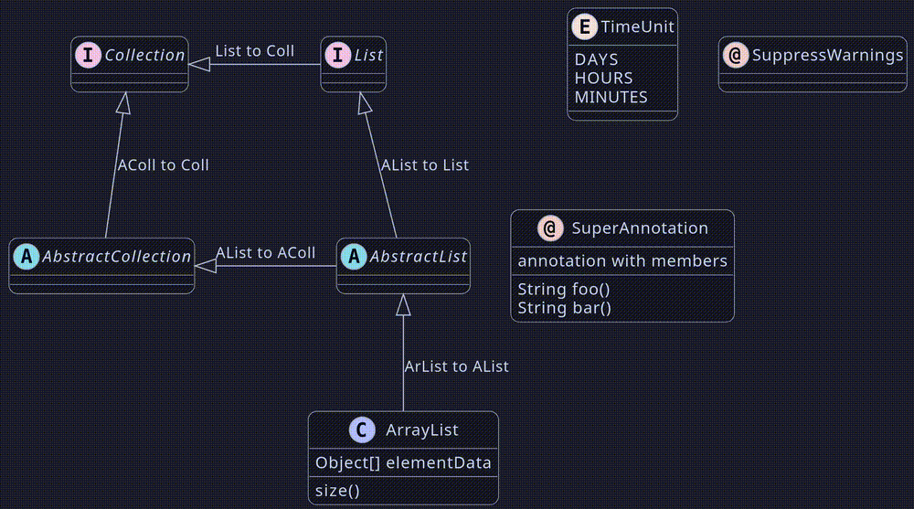

[](https://badge.fury.io/py/mkdocs_puml)
[](https://pypistats.org/packages/mkdocs-puml)

`mkdocs_puml` is a fast and simple package that brings plantuml diagrams to MkDocs
documentation.

---------

#### 🎨 [**View mkdocs_puml themes**](themes)

---------

## Install

Run the following command to install the package

```shell
pip install mkdocs_puml
```

## How to use

Just add `plantuml` plugin into `plugins` section of your `mkdocs.yml` file,
in order to use puml with mkdocs.

```yaml
plugins:
    - plantuml:
        puml_url: https://www.plantuml.com/plantuml/
```

`plantuml` plugin uses `PlantUML` exclusively as an HTTP service.
So, you should necessarily specify `puml_url` config.

<details>
<summary>📋 <b>Full list of plugin parameters</b></summary>

The `plantuml` config with the full list of parameters is below

```yaml
plugins:
    - plantuml:
        puml_url: https://www.plantuml.com/plantuml/
        puml_keyword: puml
        verify_ssl: true
        verbose: true
        theme:
          enabled: true
          light: default/light
          dark: default/dark
          url: https://raw.githubusercontent.com/.../mkdocs_puml/.../themes/
        cache:
          backend: local
          local:
            path: "~/.cache/mkdocs_puml"
        interaction:
          enabled: true
```

Where

| Parameter      | Type                   | Description                                                                 |
|----------------|------------------------|-----------------------------------------------------------------------------|
| `puml_url`     | `str`. Required        | URL to the PlantUML service                                                 |
| `puml_keyword` | `str`. Default `puml`  | The keyword for PlantUML code fence, i.e. \```puml \```                     |
| `verify_ssl`   | `bool`. Default `True` | Designates whether `requests` should verify SSL or not                      |
| `verbose`      | `bool`. Default `True` | Designates whether `mkdocs_puml` should print status messages to console    |
| `theme.enabled` | `bool`. Default `True` | Designates whether `plantuml` plugin should manage themes of the diagrams |
| `theme.light`  | `str`. Default `default/light` | Name of the theme to use when `mkdocs-material` is in light mode |
| `theme.dark`  | `str`. Default `default/dark` | Name of the theme to use when `mkdocs-material` is in dark mode |
| `theme.url`   | `str`. Defaults to this repository URL | URL to the repository folder where themes are located |
| `cache.backend` | `enum`. `disabled` or `local` | Specifies the storage to use for preserving diagrams |
| `cache.local.path` | `str`. Defaults to `~/.cache/mkdocs_puml` | Defines path where `mkdocs_puml` stores diagrams |
| `interaction.enabled` | `bool`. Defaults to `True` | Designates whether rendered diagrams should be interactive |

</details>

Now, add PlantUML diagrams into your `.md` documentation. For example,

<pre>
## PUML Diagram

```puml
@startuml
Bob -> Alice : hello
@enduml
```
</pre>

At the build step `mkdocs` sends requests to `puml_url` and substitutes your
diagram with the `svg` images from the responses.

## Themes

`mkdocs_puml` integrates with
[mkdocs-material](https://squidfunk.github.io/mkdocs-material/) to display the diagrams
based on the selected light or dark mode. The plugin automatically includes the
configured theme into the first line of the PlantUML diagram (if it's not C4 diagram).
This allows developers to add custom styles to each diagram, which will take priority
over pre-defined themes.

❕ In case of C4 diagrams, their styles are kept inside C4 library files. Since
`mkdocs_puml` themes contain styling of C4 as well, our themes will be included after
the last C4 library file. This way, it's **highly advised** to place C4
`!include` instructions at the top of the diagram.

To learn how to use and view available themes, check out the
🎨 [**dedicated `mkdocs_puml` themes page**](themes).

Pay attention that for each PlantUML diagram, `mkdocs_puml` generates two `svg` images:
one for light mode and another for dark mode. If you want to disable theming and
generate one `svg` for each diagram, set `enabled` to `false` as follows

```yml
plantuml:
  ...
  theme:
    enabled: false
```

## 🌀 Interactive diagrams

By default all diagrams are now interactive. When you hover mouse over a diagram
few buttons will appear at the top left corner:

* `Copy` button copies the SVG code to the clipboard.
* `Plus` button zooms in on the diagram.
* `Home` resets the diagram to its default view.
* `Minus` button zooms out on the diagram.

Additionally, the following mouse events are supported

* `Drag` the diagram moves it.
* `Shift` + `Scroll` zooms in or out on the diagram.

<details>
<summary>💡 <b>View an example</b></summary>


</details>

⚠️ This is still an experimental feature that require thorough testing.
If you want to disable interactive diagrams add this plugin's configuration

```yml
plantuml:
  ...
  interaction:
    enabled: false
```

## Run PlantUML service with Docker

It is possible to run [plantuml/plantuml-server](https://hub.docker.com/r/plantuml/plantuml-server)
as a Docker container.

Add a new service to the `docker-compose.yml` file

```yaml
services:
  puml:
    image: plantuml/plantuml-server
    ports:
      - '8080:8080'
```

Then substitute `puml_url` config with the local URL in the `mkdocs.yml` file

```yaml
plugins:
    - plantuml:
        puml_url: http://127.0.0.1:8080
        num_workers: 8
```

This approach works a bit faster than [plantuml.com](https://www.plantuml.com/plantuml/)
and you can avoid `509 Bandwidth Limit Exceeded` error.

### Standalone usage

You can use `PlantUML` converter without `mkdocs`. See an example below

```python
from mkdocs_puml.puml import PlantUML

puml_url = "https://www.plantuml.com/plantuml"

diagram1 = """
@startuml
Bob -> Alice : hello
@enduml
"""

diagram2 = """
@startuml
Jon -> Sansa : hello
@enduml
"""

puml = PlantUML(puml_url)
svg_for_diag1, svg_for_diag2 = puml.translate([diagram1, diagram2])
```

## License

The project is licensed under [MIT license](LICENSE).

## Special Thanks

**TODO: thank developers**

* catppuccin
* lucide
* https://github.com/timmywil/panzoom?tab=readme-ov-file
